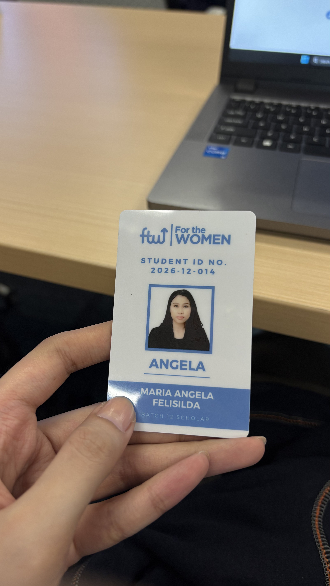
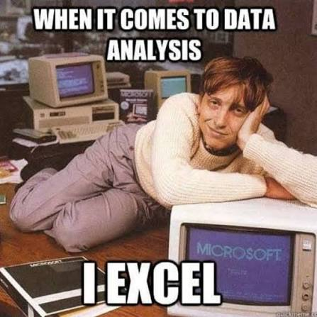

# Journal - 2026-07-25 - Day 1: Making Data Useful

## Today in one sentence
- Day 1 immediately set the tone for FTW: fast-paced, hands-on, collaborative, and focused on building a stronger foundation for how we think about and work with data.

## What I learned
- One thing I really appreciated about the first day was that we started with the basics. Even though I already work with data, the session helped reframe the importance of understanding the problem and the data first before immediately jumping into analysis.

- I learned more about the overall process of making data useful: identifying the relevant data, checking its quality, preparing it properly, analyzing it, and eventually turning the results into something that can support a decision.

- We discussed different data quality attributes such as consistency, accuracy, completeness, auditability, validity, uniqueness, and timeliness. It was a good reminder that the quality of an analysis heavily depends on the quality of the data behind it.

- We were already given individual and group activities on the first day, which made me realize that FTW is not going to be like the usual lecture-heavy classes. We were immediately expected to work with the data, discuss our ideas, and figure things out ourselves.

- For the individual exercise, I found myself using PivotTables in Excel to answer the questions. 

## Terms I am still learning
- **INFORMS Analytics Process** - a structured analytics process that starts with framing the business and analytics problem, identifying the required data, selecting an appropriate methodology, building and deploying the solution, and managing it throughout its lifecycle.

## What confused me
- I got slightly confused about the difference between **consistency** and **accuracy** because they initially sounded very similar to me.

- I am also still adjusting to how quickly we move from learning a concept to applying it in an exercise or group activity.

## One small next step
- [ ] Review the Day 1 exercises and become more intentional about checking data quality before starting an analysis.
- [ ] Supplement the FTW homework with additional DataCamp courses so I can practice the concepts more deeply outside class.

## Git checkpoint
- [x] I created or updated a file
- [x] I wrote a commit
- [x] I pushed my changes

## Decisions or assumptions
- I decided to use PivotTables for the individual exercise because they were a quick and familiar way for me to aggregate the data and answer the questions being asked.

## Evidence from today 
- Day 1 lecture: **Making Data Useful**
- Individual data analysis exercise using Excel and PivotTables
- Group activities and discussions
- My first official day as an FTW Data Engineering Batch 12 scholar

## Reflection 

### What felt easy today?
- Working with the data in Excel felt familiar, especially using PivotTables to summarize and explore the dataset.

### What felt difficult today?
- The pace surprised me. We already had individual and group activities on the first day, so I quickly realized that I will need to keep up and actively participate rather than simply absorb the lectures.

### What do I want to understand better next time?
- I want to become more intentional about the steps that happen before the actual analysis, especially how I assess whether the data is reliable enough to use.

Sir Myk was our speaker for the day, and this was actually our first time meeting him since we did not get to meet him during the orientation. My first impression was that he really knows what he is talking about. His lectures are packed with learnings, but I also like how he casually throws in jokes here and there, which makes the session feel lighter and more engaging.

It is only the first day, yet I already feel like I learned a lot. I am excited for what comes next, especially because I appreciate how the program is starting from the fundamentals and helping us reframe our mindset around the importance of data before we go deeper into Data Engineering.

And of course, **happy birthday, Sir Myk!** 🎉

## Mood or meme 

Pretty accurate for Day 1 considering I immediately reached for PivotTables. 😅

## Highlight of the Day 
- One of the biggest highlights of my first day was finally meeting and working alongside my fellow FTW scholars. It feels like a privilege to be studying with a group of like-minded women who are also investing their time and effort into growing in the field of data.

- Seeing everyone participate in the activities and share their own perspectives made the experience feel even more meaningful. I am looking forward to learning not only from the instructors, but also from the women I will be going through this journey with.
